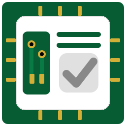

# KiNotes — Smart Engineering Notes for KiCad 9+

<p align="center">
  
</p>

<<<<<<< HEAD
**Version 1.5.1** — Your design decisions shouldn't live in a separate notepad. KiNotes keeps engineering notes right inside KiCad—where they belong.
=======
**Version 1.5.2** — Your design decisions shouldn't live in a separate notepad. KiNotes keeps engineering notes right inside KiCad—where they belong.
>>>>>>> dev

[](LICENSE)
[](https://www.kicad.org/)
[](https://github.com/sponsors/way2pramil)

> 🎯 **For KiCad 9.0+** — Built for modern KiCad with Python 3 and wxPython 4.

---

## The Problem We Solve

Every PCB designer has been there:

*"Why did I choose this capacitor value?"*  
*"What was wrong with Rev A again?"*  
*"Where did I write down that test result?"*

Design notes end up scattered across text files, sticky notes, emails, and memory. When you need them months later—during a redesign or debugging session—they're either lost or useless without context.

**KiNotes fixes this by keeping notes where they matter: inside your KiCad project.**

---

## 🔗 Smart-Link: Click to Highlight

This is what makes KiNotes different. When you mention a component or net in your notes, it becomes **clickable**.

**Type naturally:**
> "The filtering on the ADC input needs work. R23 and C45 values might be too aggressive for the signal bandwidth we need."

**Click `R23` → that resistor lights up on your PCB.** No searching. No scrolling through the schematic. One click.

This works with:
- **Component designators**: R1, C5, U3, LED1, SW2, Q7...
- **Net names**: VCC, GND, SDA, UART_TX, Motor_PWM...
- **Custom prefixes**: Add your own (MOV, NTC, PTC, whatever you use)

The link works both ways—your notes stay connected to your design, not floating in a separate file.


---

## 📋 Task Tracking That Stays With Your PCB

Hardware projects have TODOs that span weeks or months. "Fix thermal relief on U5" doesn't belong in a generic task app—it belongs with the board.

KiNotes includes a simple todo list:
- Tasks saved in `.kinotes/` folder alongside your project
- Check off items as you complete them
- Optional time tracking per task (for billing or personal records)
- Everything stays local—no cloud, no accounts, no sync issues

---

## 💾 Stay Local, Stay With Your PCB

KiNotes stores everything in a `.kinotes/` folder inside your project directory:

```
my_project/
├── my_project.kicad_pcb
├── my_project.kicad_sch
└── .kinotes/
    ├── KiNotes_my_project.md    ← Your notes
    ├── todos.json                ← Task list
    ├── settings.json             ← Preferences
    └── images/                   ← Pasted images (Beta)
```

**What each file contains :**
- **`KiNotes_<projectname>.md`** — Your KiNotes in Markdown format (supports both visual editor and raw markdown editing) with Autosave
- **`todos.json`** — Task list with completion status, optional time tracking data, and session history with Autosave
- **`settings.json`** — Your UI preferences (theme, panel size, editor mode, Smart-Link options, beta toggles)

> 💡 **Tip:** Tip: The Export Diary button in the Todo tab creates a clean work-log summary (time spent per task, session details) and inserts it directly into your Markdown notes. Perfect for quick reports or timesheets.

**Why this matters:**
- **Git-friendly**: Notes version with your design
- **Portable**: Move project = move notes
- **No cloud dependency**: Works offline, forever
- **No accounts**: Just files on your disk
- **Plain Markdown format**: Notes readable by any text editor, easy for future tools and analysis

---

## 🧠 Auto-Save (Because Engineers Forget)

> *"Ctrl+S? What's that?"* — Me, while mentally routing a 4-layer stackup

Let's be honest. Pressing **Ctrl+S** takes half a second. It's the easiest thing in the world. And yet... 🤷

When your brain is juggling impedance calculations, component placement, thermal reliefs, and that one via that *refuses* to fit—saving is the last thing you remember. You close KiCad, realize you lost an hour of notes, and stare at the ceiling questioning your life choices.

**KiNotes just saves.** 💾 Every edit, automatically. No popup asking "Do you want to save?" No panic when KiCad crashes. Your notes survive your forgetting.

*Built by someone who has lost notes too many times to admit.* 😅

---

## ✨ Features

### Core (Stable)
| Feature | Function | Status |
|---------|----------|--------|
| **Visual Editor** | Notion-like rich text—bold, lists, headings | ✅ Stable |
| **Smart-Link Designators** | Click R1, U3, C5 → highlight on PCB | ✅ Stable |
| **Smart-Link Nets** | Click GND, VCC, SDA → highlight traces and pads | ✅ Stable |
| **Smart-Link Tooltips** | Hover over R1 → show Value, MPN, Layer | ✅ Stable |
| **Custom Prefixes** | Add your own designators (MOV, NTC, PTC, etc.) | ✅ Stable |
| **Auto-Save** | Never lose work—saves on every change | ✅ Stable |
| **Dark/Light Mode** | Custom color schemes for both themes | ✅ Stable |
| **Import Metadata** | Pull BOM, stackup, board size into notes | ✅ Stable |
| **Export PDF** | Print-ready documentation | ✅ Stable |
| **Task List** | Simple todos that live with your project | ✅ Stable |
| **Time Tracking** | Per-task stopwatch with session history | ✅ Stable |
| **Export Diary** | Generate work-log summary for timesheets | ✅ Stable |
| **Session History** | Track when and how long you worked | ✅ Stable |
| **Keyboard Shortcuts** | Ctrl+B bold, Ctrl+I italic, Ctrl+S save | ✅ Stable |
| **Git-Friendly Storage** | Plain Markdown files version with your PCB | ✅ Stable |
| **Resizable Panel** | Drag to resize, remembers your preference | ✅ Stable |
| **High-DPI Support** | Sharp UI on 4K and Retina displays | ✅ Stable |
| **Crash Recovery** | Auto-backup prevents data loss | ✅ Stable |
| **100% Offline** | No internet, no cloud, no accounts ever | ✅ Stable |
| **Portable Projects** | Move folder = move everything | ✅ Stable |
| **Undo/Redo** | Full edit history in visual editor | ✅ Stable |
| **Settings Persistence** | Per-project preferences saved automatically | ✅ Stable |

### Beta (Experimental)
| Feature | Function | Status |
|---------|----------|--------|
| **Markdown Editor Mode** | Toggle between visual and raw markdown | 🧪 Beta |
| **BOM Tab** | Dedicated Bill of Materials generator | 🧪 Beta |
| **Version Log Tab** | Design revision tracking | 🧪 Beta |
| **Debug Panel** | Event logging for troubleshooting | 🧪 Beta |
| **Image Paste** | Ctrl+V to paste images → `.kinotes/images/` | 🧪 Beta |
| **Fab Summary Import** | Import board fabrication info with selection | 🧪 Beta |


### Planned
| Feature | Function | Status |
|---------|----------|--------|
| **Slash Commands** | Type /rev, /date, /company for live KiCad data | ✅ v1.5.2 |
| **KiCad Settings Sync** | Autosave interval syncs with KiCad preferences | ✅ v1.5.2 |
| **Voice Input** | Add notes hands-free using local speech-to-text | 📋 Planned |

---

## 🚀 Quick Start

### Installation

**Manual Installation**
1. Download the latest release from [GitHub Releases](https://github.com/way2pramil/KiNotes/releases)
2. Copy `KiNotes/` folder to:
   - **Windows:** `%APPDATA%\kicad\9.0\scripting\plugins\`
   - **macOS:** `~/Library/Preferences/kicad/9.0/scripting/plugins/`
   - **Linux:** `~/.config/kicad/9.0/scripting/plugins/`
3. Restart KiCad

> ✅ **KiCad Plugin Manager** — Available now! Search "KiNotes" in KiCad's Plugin Manager (Tools → Plugin and Content Manager).

### First Use
1. Open any PCB in pcbnew
2. Click **KiNotes** button in toolbar (or Tools → External Plugins → KiNotes)
3. Start writing

That's it. Notes auto-save. Links work immediately.

---

## 📖 The Story Behind KiNotes

Every hardware project starts with excitement—that rush when a new board idea clicks into place. But somewhere between the first schematic and the final layout, things get messy. You're routing traces at 2 AM, chasing DRC errors, fixing the same footprint issue for the third time.

Here's what I noticed after years of PCB work: **the projects that succeeded weren't always the most clever designs. They were the ones with clear notes.** The ones where I could remember why I chose that capacitor value, or what test failed on Rev A.

KiNotes started as a simple text file I kept open next to KiCad. Nothing fancy—just a scratch pad for design decisions. But I kept losing it, forgetting to save, opening the wrong version. The notes lived outside the project, and that was the problem.

**So I built this.** A notes panel that lives inside KiCad, saves automatically with your project, and stays out of your way until you need it. No cloud accounts, no sync conflicts, no friction.

The philosophy hasn't changed: **a note written today saves hours tomorrow.** A design decision documented now prevents the same argument six months later. It's not about being organized—it's about not repeating your own mistakes.

KiNotes is open source because good tools should be shared. If it helps you ship better boards, that's the goal.

*Built for engineers who've learned that memory is unreliable, but good notes aren't.*

---

## 🔧 Requirements

- **KiCad 9.0** (Python 3.9+, wxPython 4.2+)
- **Optional:** `reportlab` — for 💾 PDF Export support
  ○ 📝 Markdown (Plain text, lightweight)
  ● 🎨 Formatted (Preserves bold, italic, lists)
  ℹ️ Formatted export requires 'reportlab'. 
  ```bash
  pip install reportlab
  ```
  Without it, PDF export falls back to plain text format.

## 🤝 Contributing

Contributions welcome! The codebase is modular—small, focused files that are easy to understand and modify.

1. Fork the repository
2. Create a feature branch
3. Submit a pull request

---

## 💝 Support This Project

If KiNotes helps you ship better boards, consider supporting its development:

[](https://github.com/sponsors/way2pramil)

Your sponsorship helps cover development time and keeps the project actively maintained. Every contribution—big or small—is deeply appreciated!

---

## 📄 License

**Apache License 2.0** — free for personal and commercial use.

`SPDX-License-Identifier: Apache-2.0`

---

<p align="center">
  <sub>Built with ❤️ for hardware engineers who take notes</sub>
</p>
